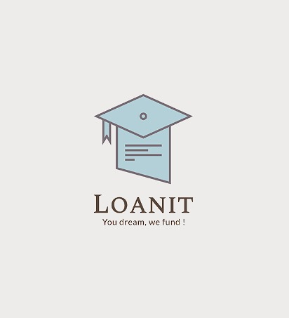

# 🎓 LoanIt — Education Loan Platform

> **You dream, we fund!** — A DSA-model education loan platform connecting students with the best bank offers.



---

## 🌐 Live Demo

**👉 [https://aadityakumarchoudhary.github.io/LoanIt](https://aadityakumarchoudhary.github.io/LoanIt)**

---

## 📌 About the Project

**LoanIt** is a web-based education loan platform built on the **DSA (Direct Selling Agent)** model. Students fill one application form, get matched with multiple banks, compare loan offers, and apply — all in one place. LoanIt earns a commission from the bank; the student pays nothing.

This project was built as a college web development project at **IILM University, Greater Noida**.

---

## ✨ Features

### 👨‍🎓 Student Side
- 🔐 Register & login with real Firebase Authentication
- 📝 4-step loan application form with eligibility checker
- ⚖️ Compare 6 banks side-by-side with live EMI calculator
- 📊 Personal dashboard showing application status
- 📁 Document upload tracking (Aadhaar, PAN, marksheets, etc.)
- 🔄 Real-time status updates (Submitted → Under Review → Approved → Disbursed)

### 🛡️ Admin Side
- View all student applications from one panel
- Search, filter by status and bank
- Update application status with one click
- View all registered users

---

## 🏗️ Tech Stack

| Technology | Usage |
|------------|-------|
| HTML5 | Structure of all 6 pages |
| CSS3 | Styling, animations, responsive design |
| JavaScript (ES6) | All logic, DOM manipulation |
| Firebase Auth | Real user login & registration |
| Cloud Firestore | Real-time database for applications |
| GitHub Pages | Free live hosting |

> **No frameworks. No backend server. No npm.** Pure HTML, CSS, and JavaScript with Firebase as the backend.

---

## 📁 Project Structure

```
LoanIt/
├── index.html        → Landing page (hero, how it works, govt schemes)
├── login.html        → Student & admin login + registration
├── register.html     → 4-step loan application form
├── compare.html      → Bank comparison engine + EMI calculator
├── dashboard.html    → Student dashboard (Firebase real-time data)
├── upload.html       → Document upload with Firebase tracking
├── admin.html        → Admin panel (manage all applications)
├── firebase.js       → Firebase config & shared module
├── style.css         → Complete shared stylesheet
├── app.js            → Shared utility functions
└── logo.jpg          → LoanIt brand logo
```

---

## 🏦 Banks Integrated

| Bank | Interest Rate | Max Loan | Processing Fee |
|------|--------------|----------|----------------|
| State Bank of India | 8.15% | ₹15L | 0.5% |
| Union Bank | 8.05% | ₹20L | 0.5% |
| Bank of Baroda | 8.35% | ₹15L | 1% |
| Punjab National Bank | 8.45% | ₹10L | Nil |
| HDFC Bank | 9.50% | ₹20L | 1% |
| Axis Bank | 13.70% | ₹40L | 2% |

---

## 🚀 Getting Started

### Run Locally
1. Clone the repository:
   ```bash
   git clone https://github.com/aadityakumarchoudhary/LoanIt.git
   ```
2. Open the folder in VS Code
3. Right-click `index.html` → **Open with Live Server**
4. The app opens at `http://127.0.0.1:5500`

### Login Credentials
| Role | Email | Password |
|------|-------|----------|
| Admin | admin@loanit.in | admin123 |
| Student | Register a new account | — |

---

## 🗺️ App Flow

```
Landing Page → Login / Register → Apply for Loan (4 steps)
     ↓
Bank Selection → Submit Application → Firestore Database
     ↓
Student Dashboard (track status) ←→ Admin Panel (update status)
```

---

## 🏛️ Government Schemes Covered

- **CSIS** — Central Sector Interest Subsidy (full interest subsidy during moratorium)
- **Padho Pardesh** — Interest subsidy for minority students studying abroad
- **Dr. Ambedkar Scheme** — For OBC/EBC students studying overseas

---

## 🔮 Future Enhancements (Phase 2)

- [ ] Firebase Storage for actual document file uploads
- [ ] Email notifications on status change
- [ ] Razorpay payment gateway integration
- [ ] SMS-based UPI transaction auto-import
- [ ] AI-based loan eligibility prediction
- [ ] Mobile app using Progressive Web App (PWA)
- [ ] CSV/PDF export of applications

---

## 👨‍💻 Developer

**Aaditya Kumar Choudhary**
IILM University, Greater Noida
Web Development Project — 2025–26

---

## 📄 License

This project is built for educational purposes as part of a college submission.

---

<p align="center">Made with ❤️ by Aaditya | <a href="https://aadityakumarchoudhary.github.io/LoanIt">Live Demo</a></p>